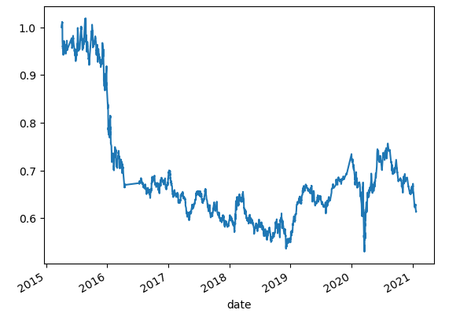

# Machine Learning Trading Bot

/GettyImages-1151577420-0a1caa7c85a34411820816f7653c3c58.jpg)

In this challenge, I assumed the role of a financial advisor at one of the top five financial advisory firms in the world. I plan to improve the existing algorithmic trading systems and maintain the firm’s competitive advantage in the market. To do so, I have enhanced the existing trading signals with machine learning algorithms that can adapt to new data.

## Steps:

The steps for this challenge are divided into the following sections:

* Establish a Baseline Performance

* Tune the Baseline Trading Algorithm

* Evaluate a New Machine Learning Classifier

* Create an Evaluation Report

### Performance Report (Baseline Trading Algorithm)

Our baseline trading algorithm:

### Tuned Trading Algorithm

I increased the SMA short window to 25 and increased the DateOffset to 6 months in efforts to tune the algorithm.

Here are my results:

#### Impact of changing the training window:

When I increased the training window, there was a drop in precision and accuracy with both 1 and -1 precisions averaging out at around 50%. There were also changes in recall and F1-score, with an increase for the -1 signal. Decreasing the training window saw a negligible improvement.

#### Impact of changing the SMA windows:

Decreasing the SMA window resulted in a better performance of the algorithm, and increasing the window resulted in a worse average performance based on precision, recall, and F1-score.

### Performance Report (New Machine Learning Model)

#### Did this new model perform better or worse than the provided baseline model?

Yes, it performed better than the baseline model overall.

#### Did this new model perform better or worse than your tuned trading algorithm?

The difference between the two is negligible.

## Evaluation Report

The choice between which model/algorithm to use depends on the context of what we are trying to achieve. However, I will recommend the baseline for higher accuracy and precision and the new machine learning model for a higher recall and F1-score on the -1 signals.

